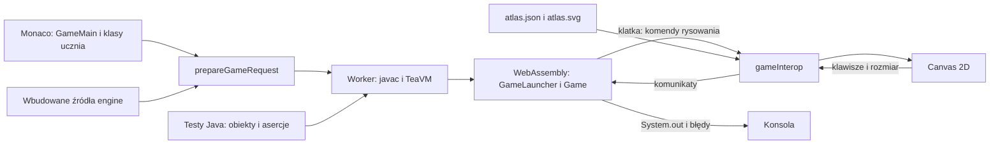
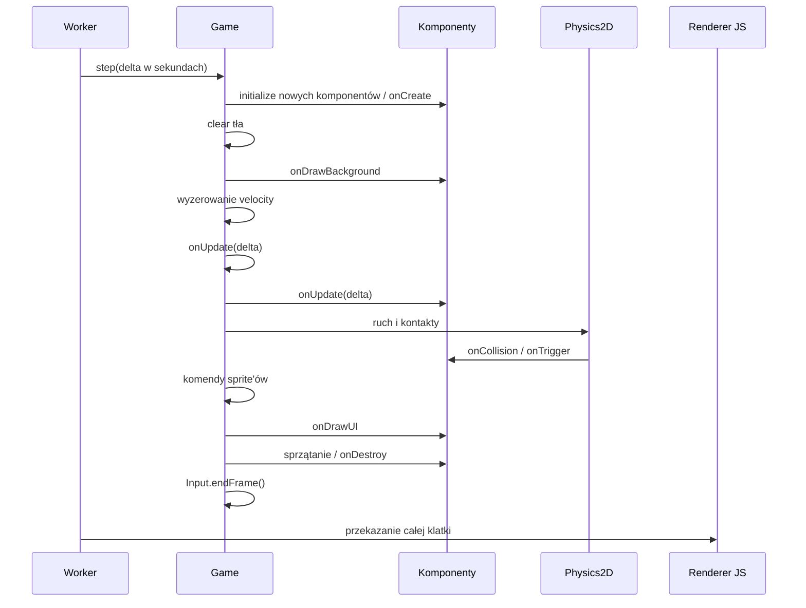
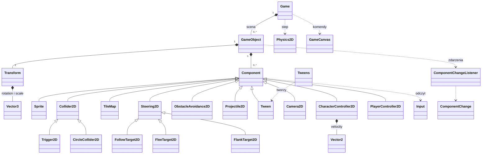

# Silnik Java Lab

Dokumentacja wdrożonego API w gameCoreRuntime.js, gameExtrasRuntime.js i gamePhysicsRuntime.js. Bibliotekę składa gameEngineRuntime.js.

## Architektura

Stan gry, komponenty, ruch i kontakty należą do Javy. JavaScript obsługuje wejście, transport komunikatów, atlas i rysowanie. Canvas nie jest źródłem stanu gry.



Uczeń pisze `GameMain extends Game` i własne komponenty. Pliki dostają wspólny pakiet `lab` oraz `import engine.*`. Osobny pakiet `engine` chroni bibliotekę przed konfliktem nazw. Generowany `GameLauncher` ukrywa `main`, `tick`, `frame`, `setKey`, `resize` i `dispose`. Źródła API otwiera się przez Ctrl+klik/F12, tylko do odczytu.

## Cykl klatki — działające API



`delta` jest ograniczone do 0.1 s. `move` trzeba wywoływać w każdej klatce ruchu: prędkość kontrolera jest zerowana przed aktualizacją. Komponenty i obiekty aktualizowane są z kopii list, aby zmiany kolekcji nie uszkadzały iteracji.

## Klasy i pola — działające API

Pola poniżej są publiczne, chyba że zaznaczono inaczej. Komponenty dziedziczą pola `Component`. `final` blokuje podmianę referencji, nie zmianę wnętrza wektora.

| Klasa | Pola | Najważniejsze metody |
| --- | --- | --- |
| `Game` | `String background`; prywatne listy `objects`, `removed` oraz flagi `started`, `disposed` | `createObject`, `getObjects`, `start`, `step`, `isDisposed`, `dispatchContact`, `dispose`; hooki `onCreate`, `onUpdate`, `onDestroy` |
| `GameObject` | `final Transform transform`, `String name`, `boolean active`, `boolean destroyed`, `final Game game`; prywatne `components`, `removed`, `listeners`, `updating` | `setPosition`, `addComponent`, `getComponent`, `getComponents`, `hasComponent`, `removeComponent`, `removeComponents`, `onComponentChange`, `destroy`; starsze `update`, `draw` |
| `Component` | `GameObject gameObject`, `boolean enabled`; wewnętrzne flagi `created`, `removed`, `destroyed` | `getGame`, `getComponent`, `getComponents`, `hasComponent`, `removeComponents`, `requireComponent`; hooki cyklu życia i kontaktów, onDrawBackground, onDrawUI; starsze `start`, `update` |
| `Sprite` | `String texture`, `double width`, `double height` | konstruktory z kluczem atlasu i opcjonalnym rozmiarem; domyślnie player, 32×32 |
| `Collider2D` | `boolean isStatic`, `boolean isTrigger` | konstruktor domyślny i z flagą; uwaga: aktualna fizyka nie wykorzystuje flagi `isStatic` do wyboru ruchomego ciała |
| `Trigger2D` | dziedziczy `Collider2D` | kontakt bez blokowania ruchu |
| `CharacterController2D` | `final Vector2 velocity`, `boolean collideWorldBounds = true` | `move(x, y)`, `move(x, y, speed)` |
| `PlayerController2D` | dziedziczy `Component` | abstrakcyjna baza bez gotowego sterowania; logikę pisze uczeń |
| `Transform` | `double x`, `double y`, `final Vector3 rotation`, `final Vector3 scale`, `final Vector2 visualOffset` | konstruktor pozycji; obrót początkowo (0,0,0), skala (1,1,1) |
| `Vector2` | `double x`, `double y` | konstruktor pusty i z wartościami |
| `Vector3` | `double x`, `double y`, `double z` | konstruktor z wartościami |
| `ComponentChange` | `final String type`, `final Component component`, `final GameObject object` | typ zdarzenia: added / removed |
| `ComponentChangeListener` | brak | interfejs `onChange(change)` |
| `Physics2D` | brak przechowywanego stanu | wewnętrzne `step`, testy nakładania i ruch po osiach; nie jest komponentem |
| `GameCanvas` | prywatne statyczne `frame`, `width = 600`, `height = 400` | `clear`, `drawRect`, `drawText`, `drawCenteredText`, `drawSprite`, `frame`, `getWidth`, `getHeight`, `setSize` |
| `Input` | prywatne statyczne `keys`, `pressedKeys` | `isKeyDown`, `isKeyPressed`; infrastruktura: `setKey`, `endFrame` |
| `GameLoop` | prywatne statyczne `running` | `start`, `stop`, `isRunning`; zgodność ze starszymi przykładami, nie scheduler |



## Ruch i obrót

```java
@Override public void onUpdate(double delta) {
    double x = Input.isKeyDown("d") ? 1 : Input.isKeyDown("a") ? -1 : 0;
    double y = Input.isKeyDown("s") ? 1 : Input.isKeyDown("w") ? -1 : 0;
    requireComponent(CharacterController2D.class).move(x, y, 120);
    if (x != 0 || y != 0) gameObject.transform.rotation.z = Math.atan2(y, x);
}
```

Pozycja jest środkiem sprite'a, w pikselach CSS. Dodatnie Y biegnie w dół. Obrót `rotation.z` jest w radianach; dodatni obrót wizualnie jest zgodny z ruchem wskazówek zegara. `atan2` zakłada grafikę skierowaną w prawo — dla innych grafik potrzebna jest poprawka kąta. Renderer uwzględnia `scale.x/y`, także wartości ujemne. `rotation.x/y` i `scale.z` nie są używane w renderowaniu 2D.

`requireComponent(CharacterController2D.class)` pobiera istniejący komponent z tego samego obiektu. Nie tworzy go; brak powoduje `IllegalArgumentException`. Następnie `.move` ustawia prędkość, normalizując kierunek. Prędkość jest w px/s; domyślnie 200.

## Kolizje i ograniczenia

- `Collider2D` blokuje ruch kontrolera; `Trigger2D` zgłasza kontakt bez blokowania.
- Rozmiar AABB pochodzi ze Sprite; bez Sprite wynosi 32×32. Skala i obrót obrazu nie zmieniają tego rozmiaru.
- Fizyka aktualizuje obiekty mające aktywny `CharacterController2D`. To nie pełny silnik rigid-body; nie ma masy, sił ani obróconych colliderów.
- Hooki kontaktu mogą powtarzać się w kolejnych klatkach. Nie ma osobnych enter/stay/exit; reguły jednorazowego zbierania trzeba zabezpieczyć, np. przez `destroy()`.
- Zwykły ruch ma podkroki po osiach (maksymalnie 2048). Pociski mają sweep całego odcinka lotu dla kół i prostokątów. Cel jest traktowany w pozycji z chwili obsługi pocisku, nie jako drugie ciało w ciągłym ruchu.
- `collideWorldBounds` ogranicza pozycję do planszy. `getComponent` może zwrócić null; `requireComponent` wymaga obecności komponentu.
- onDrawBackground rysuje pod światem; onDrawUI po fizyce i sprite’ach. Starsze rysowanie w onUpdate pozostaje pod sprite’ami.

## Rozszerzenia — wdrożone

| API | Publiczne pola / konfiguracja | Odpowiedzialność |
| --- | --- | --- |
| `TileMap` | `texture`, `tileSize` | kafelkowe tło pod obiektami |
| `CircleCollider2D` | `radius`, `isTrigger` oraz pola odziedziczone z Collider2D | koło–koło i koło–AABB; promień w pikselach świata, niezależny od skali sprite'a |
| `FollowTarget2D` | `target`, `speed`, `stopDistance` | ruch do celu przez CharacterController2D |
| `FleeTarget2D` | `target`, `speed`, `safeDistance` | ucieczka od celu |
| `FlankTarget2D` | `target`, `speed`, `radius`, `clockwise` | dojście na bok i ruch wokół celu |
| `ObstacleAvoidance2D` | `lookAhead`, `weight` | lokalna korekta kierunku wokół blokujących colliderów, nie pathfinding |
| `Projectile2D` | `direction`, `speed`, `lifetime`, `owner` | lot, wygasanie, pomijanie strzelającego; skutki trafienia pisze uczeń |
| `Steering2D` | target, speed | baza generatorów kierunku AI |
| `Tween` | final property, easing, completed; prywatne elapsed, duration, fromX/fromY, toX/toY, offsetX/offsetY | cancel(), sprzątanie po zakończeniu |
| `Tweens` | brak | statyczne position, scale, rotation, shake |
| `Camera2D` | offsetX, offsetY; prywatne remaining, duration, strength, time | shake sprite’ów; tło ekranowe i HUD pozostają nieruchome |
| warstwa HUD | kolejność rysowania po świecie | wynik ponad sprite'ami |

Projekt i kontrakty: [projekt ścieżki i rozszerzeń](superpowers/specs/2026-10-02-game-dev-expansion-design.md).

## Użycie rozszerzeń

AI wymaga CharacterController2D i celu z tej samej gry; jeden aktywny Steering2D na obiekt. Brak/usunięcie/wyłączenie celu zatrzymuje ruch. ObstacleAvoidance2D.steer(x,y) zwraca korektę kierunku; nie wyszukuje ścieżki w labiryncie. speed jest w px/s, odległości w px.

Projectile2D(x,y,speed,lifetime,owner) dodaje kontroler i CircleCollider2D(4) z isTrigger=true, jeśli nie ma własnego collidera. Zachowuje istniejący kształt kołowy/prostokątny. owner oraz referencja direction są final; składowe direction można zmieniać. Najbliższe trafienie wywołuje onTrigger i kończy lot. Reguły obrażeń pozostają w klasach ucznia.

Tweens.position(object,x,y,seconds), scale(object,x,y,seconds), rotation(object,radians,seconds), shake(object,strength,seconds) zwracają Tween. easing: linear lub smooth. Nowy tween tej samej property zastępuje poprzedni. Czas 0 ustawia wynik od razu; ujemny/nieskończony czas jest błędem. cancel() pozostawia aktualną pozycję/skalę/obrót, ale usuwa shake. Destroy sprząta tweeny. Shake zmienia visualOffset, nie pozycję fizyczną ani collider.

Camera2D.shake(strength,seconds) przesuwa renderowane sprite’y; stopShake() zeruje offset. TileMap i HUD pozostają nieruchome. TileMap wymaga tileSize co najmniej 8 i klucza atlasu, np. grass/sand.

```java
GameObject enemy=createObject("Wróg").setPosition(80,120);
enemy.addComponent(new Sprite("slime"));
enemy.addComponent(new CharacterController2D());
enemy.addComponent(new CircleCollider2D(12));
enemy.addComponent(new FollowTarget2D(player));
enemy.addComponent(new ObstacleAvoidance2D());
Tweens.scale(enemy,2,2,0.5).easing="smooth";
```

## Kurs, pliki i testy

Zakresy: 101–199 podstawy, 201–299 obiekty, 301–399 dziedziczenie, 401–499 gry. Game Dev ma sześć lekcji i 18 zadań. IDs konsolowe są stabilne; stare wybory gry są mapowane bez przenoszenia starych zaliczeń na nowe wymagania. Stary kod zostaje w localStorage, ale nie otwiera się automatycznie w nowych zadaniach.

Pliki startowe i engine są chronione. Własne pliki usuwa przycisk „Usuń plik” z potwierdzeniem; operacja usuwa zapis pliku i zaliczenie zadania. Przed usunięciem skopiuj potrzebny kod — nie ma kosza.

Testy deweloperskie gameEngineJava.test.js wymagają istniejącego JDK 21+ (JAVA_HOME, .jdks lub PATH). Nie jest ono potrzebne aplikacji ucznia. Testy przeglądarkowe: /tools/expanded-engine-check.html i /tools/game-runtime-check.html. Asercje zadań wykonuje JavaTest, nie regex ani obraz canvasu.

